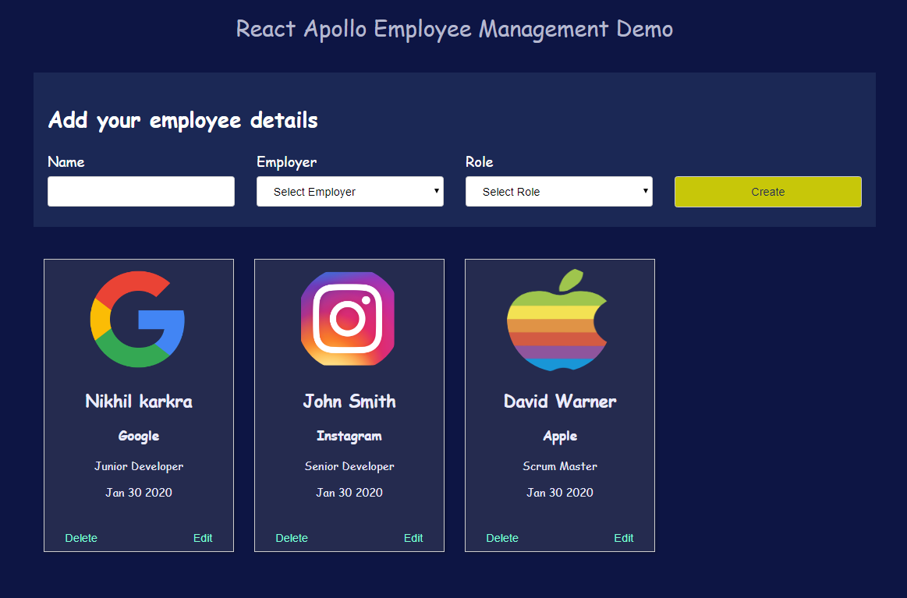
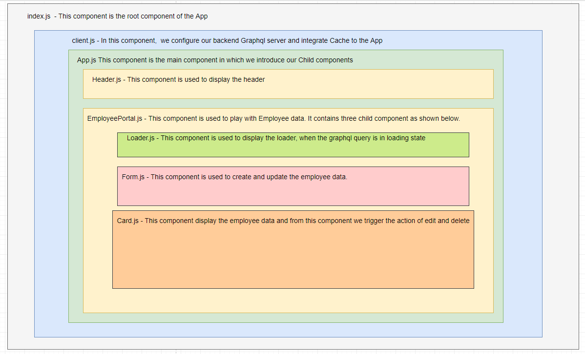

# React Apollo Employee Management Demo

## To start the project run the following command
### `npm install`  
### `cd client`  
### `npm install` 
### `cd ..`
### `npm start`

## Graphql Sever will run on 
###  `http://localhost:1234/ `

## Final Output

## App component design

## Working Output 
<video width="320" height="240" controls>
  <source src="./asset/React App.mp4" type="video/mp4">
  Your browser does not support the video tag.
</video>
